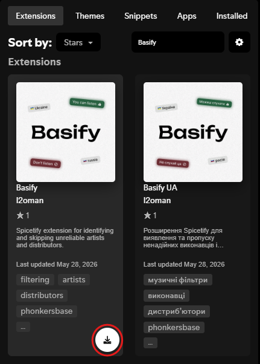

# Basify

Basify is a Spicetify extension that helps you avoid tracks connected to russian music infrastructure.

The extension gets artist and distributor information from [Phonkersbase](https://www.phonkersbase.com/en), checks the currently playing Spotify track, and can react based on your selected Basify settings.

Basify is built for users who want a safer and clearer Spotify experience when artist origin, distributor information, and links to the russian market matter.

## What Basify does

Basify can be configured from its settings menu to:

- Skip tracks by blocked artists.
- Skip tracks released by blocked distributors.
- Skip artists marked with a warning trust label.
- Skip artists with unconfirmed country of origin.
- Show a popup explaining why a track was skipped.
- Add trust/status indicators next to artist names in the Now Playing bar.
- Add country flags next to artist names in the Now Playing bar.
- Change the Now Playing bar background based on the current track’s trust level.
- Add country and trust information to Spotify artist pages.
- Use English or Ukrainian interface text.

All artist trust and country information is taken from [Phonkersbase](https://www.phonkersbase.com/en).

## Important compatibility note

Basify works through Spicetify, so it requires the official Spotify Desktop app.

At the moment, we do not know how to install Spicetify on Spotify Launcher. The recommended approach is to use the official Spotify Desktop app from the [Spotify website](https://www.spotify.com/download/).

Spicetify does **not** work with the Spotify version installed from the Microsoft Store. If you installed Spotify from the Microsoft Store, uninstall it and install Spotify Desktop from the [official Spotify website](https://www.spotify.com/download/) instead.

For full Spicetify setup details, use the [official Spicetify installation guide](https://spicetify.app/docs/getting-started.html).

## Installation through Spicetify Marketplace

This is the easiest installation method once Basify is available in the Spicetify Marketplace.

**Recommended:** install Basify through Marketplace to receive automatic updates.

### 1. Install Spotify Desktop

Install the official Spotify Desktop app from the [Spotify website](https://www.spotify.com/download/). Do not use the Microsoft Store version.

### 2. Install Spicetify and Marketplace

Follow the [official Spicetify installation guide](https://spicetify.app/docs/getting-started.html). The guide contains the latest commands for your operating system.

Common install commands:

Windows PowerShell:

Open **Windows PowerShell with normal user privileges**. Do **not** run it as Administrator unless the official Spicetify guide specifically tells you to.

```powershell
iwr -useb https://raw.githubusercontent.com/spicetify/cli/main/install.ps1 | iex
```

macOS / Linux:

```bash
curl -fsSL https://raw.githubusercontent.com/spicetify/cli/main/install.sh | sh
```

When the Spicetify installer asks whether to install Marketplace, type `yes` and press Enter. Marketplace is recommended because Basify updates automatically through it.

### 3. Open Marketplace in Spotify

Open Spotify and select **Marketplace** from the sidebar.


### 4. Find Basify

Open the **Extensions** tab and search for **Basify**.


### 5. Install Basify

Click **Install**. Restart Spotify if the extension does not appear immediately.



If Basify does not appear in Marketplace yet, use the manual installation method below.

## Manual installation

### 1. Install Spotify Desktop & Spicetify with Marketplace

Follow steps 1 and 2 from the Marketplace installation guide above to install Spotify Desktop, Spicetify, and Spicetify Marketplace.

### 2. Open the Spicetify config folder

Run:

```bash
spicetify config-dir
```

This opens the folder where Spicetify stores its configuration.


### 3. Copy Basify into the Extensions folder

Put `Basify.js` into the Spicetify `Extensions` folder in opened window from step above.


### 4. Enable the extension

Run:

```bash
spicetify config extensions Basify.js
spicetify apply
```

Restart Spotify after applying the extension.

## Updates

### Marketplace updates

**Marketplace installations update automatically through Spicetify Marketplace.**

If Basify was installed through Marketplace, you do not need to manually replace `Basify.js` for normal extension updates.

### Manual updates

If Basify was installed manually, download the latest `Basify.js`, replace the old file in the Spicetify `Extensions` folder, and run:

```bash
spicetify apply
```

### Spotify updates and Spicetify

Spotify Desktop updates can overwrite or change files that Spicetify modifies. When this happens, Basify or other Spicetify extensions may temporarily disappear, stop loading, or behave incorrectly.

After every Spotify update, re-apply Spicetify:

```bash
spicetify backup apply
```

If Spotify still looks broken, Marketplace is missing, or extensions do not load, try a full restore and re-apply:

```bash
spicetify restore backup apply
```

If Spicetify itself is outdated, update it:

```bash
spicetify update
```

Then apply Spicetify again:

```bash
spicetify backup apply
```

If Basify disappeared after a Spotify or Spicetify update, install it again from Marketplace. If you installed Basify manually, copy the latest `Basify.js` back into the Spicetify `Extensions` folder and run:

```bash
spicetify config extensions Basify.js
spicetify apply
```

If no Spicetify update is available yet, the new Spotify version may not be supported by Spicetify. In that case, check the [official Spicetify installation guide](https://spicetify.app/docs/getting-started.html) and [official Spicetify FAQ](https://spicetify.app/docs/faq.html) for the latest instructions.

## Removing Basify

Run:

```bash
spicetify config extensions Basify.js-
spicetify apply
```

You can also remove `Basify.js` from the `Extensions` folder after disabling it.

## Settings

Basify adds a settings button to Spotify’s top bar.

Available settings include:

- **Language** — choose English or Ukrainian.
- **Skip tracks** — enable or disable automatic skipping.
- **Skip filters** — choose whether to skip blocked, warning, or unknown artists.
- **Popup** — show or hide skip popups, change popup duration, and control how many popups can be visible at once.
- **Flags** — choose flag display style.
- **Now Playing Bar** — enable or disable background highlighting, artist name colouring, status shapes, and artist flags.
- **Storage** — change how many artists are stored locally.
- **Reset** — restore Basify settings to default.

## Trust labels

Basify uses trust labels from Phonkersbase:

- **Our pride**
- **Based**
- **You can listen**
- **Be careful**
- **Don’t listen**
- **Origin not confirmed**
- **No artist info**
- **Blocked distributor**

Depending on your settings, Basify can skip tracks based on blocked artists, warning artists, unknown origin, and blocked distributors.

## Help and artist reports

Need help with Phonkersbase data, artist information, or Basify-related questions? Join the [Phonkersbase Discord server](https://discord.gg/gqy4Zp7wrb).

If you found an artist that should be reviewed, added, or corrected in the Phonkersbase database, submit a report through the [artist report form](https://tally.so/r/wdpG7A). Reports are reviewed by the Phonkersbase team before being added to the database.

## Notes

Basify only skips when Spotify is playing on the current device. This prevents the extension from controlling playback on another device when Spotify Connect is active.

Basify depends on Spotify and Spicetify internal APIs. Spotify updates can sometimes break Spicetify extensions; see the update instructions above if Basify stops loading.

## Credits

Powered by [Phonkersbase](https://www.phonkersbase.com/en).

Created by [I2oman](https://github.com/I2oman).
