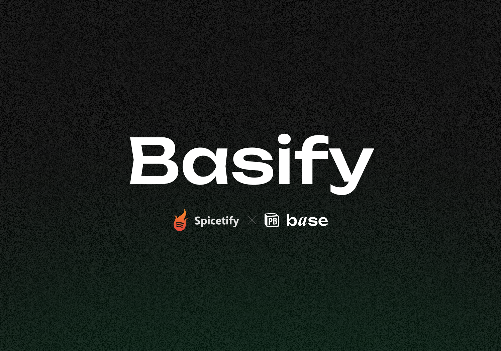
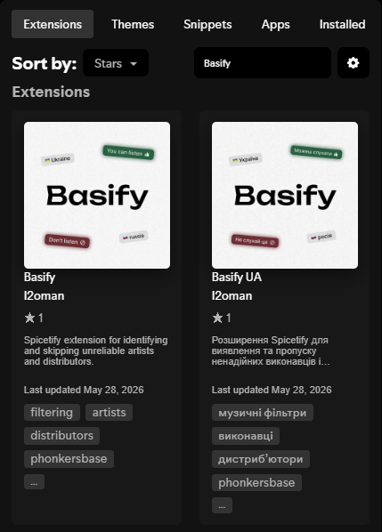
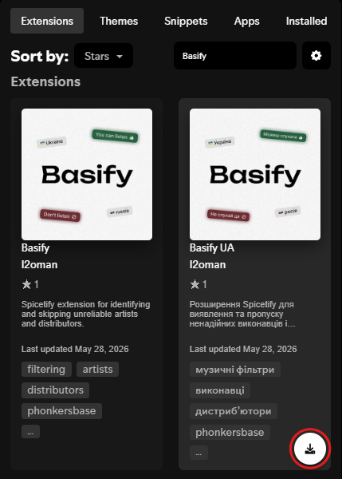
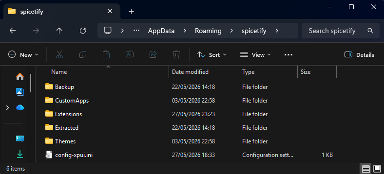
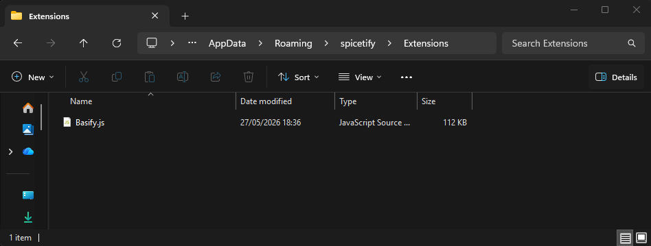

# Basify

Basify — це розширення для Spicetify, яке допомагає уникати треків, повʼязаних із російською музичною інфраструктурою.

Розширення отримує інформацію про виконавців і дистрибʼюторів із [Phonkersbase](https://www.phonkersbase.com/uk), перевіряє поточний трек у Spotify і може реагувати відповідно до вибраних налаштувань Basify.

Basify створено для користувачів, яким важлива безпечніша й зрозуміліша взаємодія зі Spotify, коли мають значення походження виконавців, інформація про дистрибʼюторів і звʼязки з російським ринком.

## Що робить Basify

Basify можна налаштувати через меню налаштувань, щоб:

- Пропускати треки заблокованих виконавців.
- Пропускати треки, випущені заблокованими дистрибʼюторами.
- Пропускати виконавців із міткою довіри «Будь обережний».
- Пропускати виконавців, країна походження яких не підтверджена.
- Показувати сповіщення з поясненням, чому трек було пропущено.
- Додавати позначки довіри й статусу біля імен виконавців на панелі поточного треку.
- Додавати прапори країн біля імен виконавців на панелі поточного треку.
- Змінювати фон панелі поточного треку відповідно до рівня довіри треку.
- Додавати інформацію про країну й рівень довіри на сторінки виконавців у Spotify.
- Використовувати українську або англійську мову інтерфейсу.

Усю інформацію про рівень довіри й країну походження виконавців взято з [Phonkersbase](https://www.phonkersbase.com/uk).

## Важлива примітка щодо сумісності

Basify працює через Spicetify, тому потребує офіційний застосунок Spotify.

Наразі ми не знаємо, як встановити Spicetify на Spotify Launcher. Рекомендований спосіб — використовувати офіційний застосунок Spotify із [сайту Spotify](https://www.spotify.com/download/).

Spicetify **не працює** з версією Spotify, встановленою з Microsoft Store. Якщо ви встановили Spotify із Microsoft Store, видаліть його та встановіть застосунок Spotify з [офіційного сайту Spotify](https://www.spotify.com/download/).

Повні інструкції з налаштування Spicetify дивіться в [офіційній інструкції зі встановлення Spicetify](https://spicetify.app/docs/getting-started.html).

## Встановлення через Маркетплейс Spicetify

Це найпростіший спосіб встановлення, коли Basify доступний у Маркетплейсі Spicetify.

**Рекомендовано:** встановлюйте Basify через Маркетплейс, щоб отримувати автоматичні оновлення.

### 1. Встановіть застосунок Spotify

Встановіть офіційний застосунок Spotify із [сайту Spotify](https://www.spotify.com/download/). Не використовуйте версію з Microsoft Store.

### 2. Встановіть Spicetify і Маркетплейс

Дотримуйтеся [офіційної інструкції зі встановлення Spicetify](https://spicetify.app/docs/getting-started.html). Вона містить актуальні команди для вашої операційної системи.

Поширені команди встановлення:

Windows PowerShell:

Відкрийте **Windows PowerShell зі звичайними правами користувача**. **Не** запускайте його від імені адміністратора, якщо офіційна інструкція Spicetify не просить зробити це окремо.

```powershell
iwr -useb https://raw.githubusercontent.com/spicetify/cli/main/install.ps1 | iex
```

macOS / Linux:

```bash
curl -fsSL https://raw.githubusercontent.com/spicetify/cli/main/install.sh | sh
```

Коли встановлювач Spicetify запитає, чи встановити Маркетплейс, введіть `yes` і натисніть Enter. Маркетплейс рекомендований, бо через нього Basify оновлюється автоматично.

### 3. Відкрийте Маркетплейс у Spotify

Відкрийте Spotify і виберіть **Marketplace** у бічній панелі.


### 4. Знайдіть Basify

Відкрийте вкладку **Extensions** і знайдіть **Basify**.



### 5. Встановіть Basify

Натисніть **Install**. Перезапустіть Spotify, якщо розширення не зʼявилося одразу.



Якщо Basify ще не зʼявився у Маркетплейсі, скористайтеся способом ручного встановлення нижче.

## Встановлення вручну

### 1. Встановіть Spotify, Spicetify і Маркетплейс

Виконайте кроки 1 і 2 з інструкції встановлення через Маркетплейс вище, щоб встановити Spotify, Spicetify і Маркетплейс Spicetify.

### 2. Відкрийте теку налаштувань Spicetify

Виконайте команду:

```bash
spicetify config-dir
```

Вона відкриє теку, у якій Spicetify зберігає свої налаштування.



### 3. Скопіюйте Basify у теку розширень

Помістіть `Basify.js` у теку `Extensions` у вікні, яке відкрилося на попередньому кроці.



### 4. Увімкніть розширення

Виконайте команди:

```bash
spicetify config extensions Basify.js
spicetify apply
```

Перезапустіть Spotify після застосування розширення.

## Оновлення

### Оновлення через Маркетплейс

**Встановлення через Маркетплейс оновлюються автоматично через Маркетплейс Spicetify.**

Якщо Basify було встановлено через Маркетплейс, для звичайних оновлень розширення не потрібно вручну замінювати файл `Basify.js`.

### Оновлення вручну

Якщо Basify було встановлено вручну, завантажте найновіший `Basify.js`, замініть старий файл у теці `Extensions` Spicetify і виконайте:

```bash
spicetify apply
```

### Оновлення Spotify і Spicetify

Оновлення настільного Spotify можуть перезаписати або змінити файли, які змінює Spicetify. Через це Basify або інші розширення Spicetify можуть тимчасово зникнути, перестати завантажуватися або почати працювати некоректно.

Після кожного оновлення Spotify повторно застосуйте Spicetify:

```bash
spicetify backup apply
```

Якщо Spotify усе ще виглядає зламаним, Маркетплейс зник або розширення не завантажуються, спробуйте повністю відновити й повторно застосувати Spicetify:

```bash
spicetify restore backup apply
```

Якщо сам Spicetify застарів, оновіть його:

```bash
spicetify update
```

Після цього знову застосуйте Spicetify:

```bash
spicetify backup apply
```

Якщо Basify зник після оновлення Spotify або Spicetify, встановіть його знову через Маркетплейс. Якщо ви встановлювали Basify вручну, скопіюйте найновіший `Basify.js` назад у теку `Extensions` Spicetify і виконайте:

```bash
spicetify config extensions Basify.js
spicetify apply
```

Якщо оновлення Spicetify ще недоступне, нова версія Spotify може поки не підтримуватися Spicetify. У такому разі перевірте [офіційну інструкцію зі встановлення Spicetify](https://spicetify.app/docs/getting-started.html) і [офіційні відповіді Spicetify](https://spicetify.app/docs/faq.html), щоб отримати найактуальніші інструкції.

## Видалення Basify

Виконайте:

```bash
spicetify config extensions Basify.js-
spicetify apply
```

Після вимкнення розширення також можна видалити `Basify.js` із теки `Extensions`.

## Налаштування

Basify додає кнопку налаштувань на верхню панель Spotify.

Доступні налаштування:

- **Мова** — вибір української або англійської мови інтерфейсу розширення.
- **Пропуск треків** — увімкнення або вимкнення автоматичного пропуску.
- **Фільтри пропуску** — вибір, чи пропускати заблокованих виконавців, виконавців із попередженням або виконавців із непідтвердженим походженням.
- **Сповіщення** — показ або приховування сповіщень про пропуск, зміна їх тривалості та ліміту видимих сповіщень.
- **Прапори** — вибір стилю відображення прапорів.
- **Панель поточного треку** — увімкнення або вимкнення підсвічування фону, забарвлення імен виконавців, позначок статусу та прапорів виконавців.
- **Сховище** — зміна кількості виконавців, що зберігаються локально.
- **Скидання** — повернення налаштувань Basify до стандартних.

## Мітки довіри

Basify використовує мітки довіри з Phonkersbase:

- **Наша гордість**
- **Базований**
- **Можеш слухати**
- **Будь обережний**
- **Не слухай це**
- **Походження не підтверджено**
- **Немає інформації про виконавця**
- **Заблокований дистрибʼютор**

Залежно від ваших налаштувань Basify може пропускати треки заблокованих виконавців, виконавців із попередженням або із непідтвердженим походженням, і треки, випущені заблокованими дистрибʼюторами.

## Допомога й додавання/виправлення інформації про виконавців

Потрібна допомога з даними Phonkersbase, інформацією про виконавців або питаннями щодо Basify? Приєднуйтеся до [Discord-сервера Phonkersbase](https://discord.gg/gqy4Zp7wrb).

Якщо ви знайшли виконавця, якого потрібно перевірити, додати або виправити в базі даних Phonkersbase, надішліть повідомлення через [форму додавання/виправлення інформації про виконавців](https://tally.so/r/wdpG7A). Усі заяви перевіряє команда Phonkersbase перед додаванням інформації до бази даних.

## Примітки

Basify пропускає треки лише тоді, коли Spotify відтворює музику на поточному пристрої. Це не дає розширенню керувати відтворенням на іншому пристрої, коли активний Spotify Connect.

Basify залежить від внутрішніх програмних інтерфейсів Spotify і Spicetify. Оновлення Spotify іноді можуть ламати розширення Spicetify. Якщо Basify перестав завантажуватися, дивіться інструкції з оновлення вище.

## Подяки

За підтримки [Phonkersbase](https://www.phonkersbase.com/uk).

Створив [I2oman](https://github.com/I2oman).
